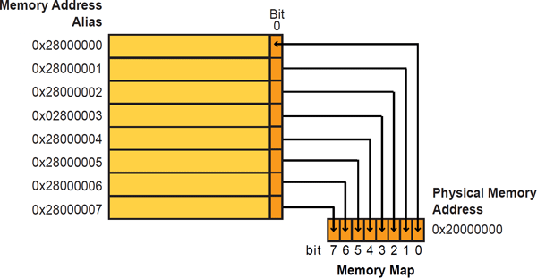

# STM32 Baremetal Programming, Flashing, and Debugging

This repository is dedicated to the basics of STM32 baremetal programming, including steps for flashing firmware using OpenOCD and debugging techniques. Additionally, it provides guidance on integrating OpenOCD with Visual Studio Code (VS Code) to streamline the debugging process.

## Contents

- Example of STM32 baremetal programs.
- Scripts and configurations for building and flashing STM32 firmware.
- Instructions for using OpenOCD
- `launch.json` and `tasks.json` configurations for setting up debugging in VS Code.


## Getting Started with STM32 Baremetal Programming

Baremetal programming involves writing code that interacts directly with hardware at a low level. This repository includes sample code that demonstrates how to control STM32 hardware registers, allowing you to perform basic operations such as blinking an LED.

### Installing Toolchain
Install `arm-none-eabi-gcc` toolchain. We are going to use this to build our project. <br>
Install `arm-none-eabi-gdb` or `gdb-multiarch` for debugging.

### Preparing the Firmware
Our project provides basic register definitions for the [STM32F401CCU MCU](https://www.st.com/resource/en/reference_manual/rm0368-stm32f401xbc-and-stm32f401xde-advanced-armbased-32bit-mcus-stmicroelectronics.pdf) to facilitate a simple blinky program.
- GPIO registers for handling General Purpose Input/Output (GPIO)
- RCC registers for managing the Reset and Clock Control (RCC)

### Describing the Linker Script

The linker script defines the memory layout for your program. It specifies the flash and RAM sizes and dictates where sections like `.text`, `.bss`, and `.data` should be placed.

### The Startup Code

This code runs before your main. This section must include the vector table and the rest handler. The reset handler is responsible for initializing the `.bss` section to zeros and copying the `.data` section to the RAM region. It calls the `main` function. If `main` returns, the handler enters an infinite loop to prevent undefined behavior. Below is a basic reset handler:
```C
#include <main.h>
#include <string.h>

extern uint32_t _MSP;  // Defined in link.ld

void Reset_Handler(void) {

    extern uint8_t __data_start__, __data_end__, __data_FLASH_end__, __bss_start__, __bss_end__;

    /* Copy the .data from flash to RAM */
    memcpy(&__data_start__, &__data_FLASH_end__, (uint32_t)(&__data_end__ - &__data_start__));
    /* Fill the .bss section in RAM with all Zeros */
    memset(&__bss_start__, 0, (uint32_t)(&__bss_end__ - &__bss_start__));

    main();
    for(;;);
}

__attribute__((section(".isr_vector"), used)) uint32_t vector_table [] = {
    (uint32_t)&_MSP,
    (uint32_t)&Reset_Handler,
};
```
Notice there is only two IRQ handler in the vector table, the MSP is not a an error handler but the vector table expects it's first element to be the MSP. 

### Building the Project

To build the project, we use a Makefile that automates the compilation and linking process. Manually compiling numerous files would be impractical; therefore, the Makefile is essential.

Simple commands to build, link and generate the ***.elf*** file
1. Compile `arm-none-eabi-gcc -c <src files *.c> <compiler flags>`
2. Link `arm-none-eabi-gcc -Wl,-T<linker script.ld> <obj files *.o> -o <app_name.elf>`

To build the project in your shell enter 
``` bash
make
```


## Flashing Firmware with OpenOCD

OpenOCD is a versatile tool for on-chip programming and debugging. A programmer is required. Usually a cheap ST-Link will simply do the job. After OpenOCD is installed and the firmware is built successfully, use the following command to flash the firmware onto the STM32F4 MCU:
`openocd -f interface/stlink.cfg -f target/stm32f4x.cfg -c "init; reset init; program firmware.elf; reset; shutdown"`

Alternatively, the Makefile includes a recipe for flashing:l

```
make flash
```

There are other options like erasing the flash.
It could be achieved by running

```
make erase
```


## Debugging

Debugging is an essential part of the development process. This section explains how to set up debugging environments using GDB CLI and Visual Studio Code (VS Code) with OpenOCD and GDB. VS Code offers a graphical user interface for interactive debugging sessions with features such as breakpoints, step execution, and variable inspection, contrasting with the text-based interface of GDB TUI.

There are two main steps to debug using OpenOCD:
1. Run the OpenOCD server that connects to the target MCU, typically listening on `localhost:3333`. Execute the following command to start the server: `openocd -f interface/stlink.cfg -f target/stm32f4x.cfg`. Do not terminate this process as it needs to run in the background.
2. Launch a GDB session that connects to the OpenOCD server.

### CLI-Based Debugging

To start a GDB session, open another terminal separate from the one running OpenOCD. In this new terminal, connect to the OpenOCD server and halt the MCU. You can automate the startup commands within GDB by storing them in a GDB configuration file. Below is an example of a basic GDB configuration file:

```bash
target remote :3333
monitor reset halt
load
b main
monitor reset init
continue
```
Launch the GDB session by running `arm-none-eabi-gdb -x <gdb-config.gdb> firmware.elf`

<NOTE:> `gdb-multiarch` can be used in place of `arm-none-eabi-gdb`. This project uses the `gdb-multiarch`.

Now successfully entered the debugging session. Hit `n` to step to next instructions. A TUI can be also enabled by executing `tui enable` This gives a more user-friendly interface.
It's possible to add custom commands to the .gdb configuration file. For example, to step and show local variables with a single command, such as np, define it like this:

``` bash
define np
  n
  info locals
end
```

The makefile contains a recipe to launch the OpenOCD server and the gdb session automatically. 
```bash
make debug
```

### VS Code Integration

Integrating OpenOCD with VS Code requires configuring the `launch.json` and `tasks.json` files in the `.vscode` directory. 

<NOTE:> Native Debugging extension must be enabled for this debug session.

The `launch.json` file specifies the debugger settings and launch configurations, while the `tasks.json` file defines tasks for building the project, starting/stopping OpenOCD, and any other pre- or post-build steps necessary.

#### launch.json
```json
    {
      "name": "(gdb) Debug",
      "type": "gdb",
      "request": "launch",
      "cwd": "${workspaceRoot}",
      "target": "${workspaceRoot}/build/binaries/firmware.elf", //path to your firmware.elf
      "gdbpath": "gdb-multiarch",
      "autorun": [
        "target extended-remote :3333",
        "monitor reset halt",
        "load",
        "b Reset_Handler",
        "b main",
        "monitor reset init"
      ],
      "preLaunchTask": "Prepare for Debug",
      "postDebugTask": "Kill OpenOCD"
    },
```

#### tasks.json
Now the `preLaunchTask` needs to be defined that will contain the perquisites required to enable the debug for example starting the openOCD server and building the project.
Similarly, a `postDebugTask` is also required that will terminate the openOCD.
An example of these tasks mentioned in `tasks.json` is shown below:

```json
{
    "version": "2.0.0",
    "tasks": [
        {
            "label": "Kill OpenOCD",
            "type": "shell",
            "command": "taskkill",
            "args": ["/IM", "openocd.exe", "/F"],
        },
        {
            "label": "Build Project",
            "type": "shell",
            "command": "make build"
        },
        {
            "label": "Prepare for Debug",
            "dependsOrder": "sequence",
            "dependsOn": ["Build Project","Start OpenOCD"]
        },        
        {
            "label": "Start OpenOCD",
            "type": "shell",
            "command": "openocd",
            "args": [
                "-f", "interface/stlink.cfg", "-f", "target/stm32f4x.cfg"
            ],
            "isBackground": true,
            "problemMatcher": {
                "owner": "cpp",
                "pattern": {
                    "regexp": ".",
                    "file": 1,
                    "location": 2,
                    "message": 3
                },
                "background": {
                    "activeOnStart": true,
                    "beginsPattern": "Open On-Chip Debugger",
                    "endsPattern": "Info : Listening on port"
                }
            },
            "presentation": {
                "echo": true,
                "reveal": "always",
                "focus": false,
                "panel": "shared",
                "showReuseMessage": true,
                "clear": false
            }
        }
    ]
}
```
After these configuration start the debug session by clicking the play button. 


## Notes

- Ensure all paths and commands within the provided scripts and configuration files are correct for your development setup.
- Update the firmware path in the `launch.json` to point to your actual `.elf` file.
- Modify the OpenOCD configuration file paths to match your setup.

With this repository, you'll have the resources to program, flash, and debug STM32F4 MCU effectively using VS Code as an integrated development environment.

## MISC
There is a powerful feature in cortex M4 device called [Bit-Banding](https://developer.arm.com/documentation/ddi0439/b/Programmers-Model/Bit-banding). With this feature, the address space gets bit-addressable. Very useful in atomic operations. An example of setting bits in GPIO register is given in [Main.c](src/main.c)
Ref the image to for a quick understanding.

.
